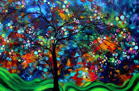

# Multimodal Data Collection and Analysis

## Overview
This project focuses on collecting and analyzing datasets across multiple modalities—images, text, audio, and structured data. We explore relationships between these different data types using various machine learning and statistical techniques.

---
## **1. Data Collection**
### **A. Image Dataset Collection**
- Selected **20 different categories**.
- Sourced images from **Google Images** and other image repositories.
- Stored and organized images for analysis.

Here are some sample images from our dataset

### **B. Text Dataset Collection**
- Chose **20 different categories** and identified **three websites per category**.
- Implemented a **web crawler** to extract relevant text data (e.g., article titles, content, publication date).
- Stored the collected data in a structured format.

### **C. Audio Dataset Collection**
- Identified **publicly available AM/FM radio stations** that stream audio online.
- Developed an **automated script** to record and store **30-90 second** audio samples.
- Saved **30 audio files** in **WAV/MP3 format** and recorded metadata (station name, timestamp, duration).

### **D. Weather Dataset Collection**
- Utilized an **open-source weather API** (e.g., OpenWeatherMap API) to collect **historical and real-time weather data**.
- Implemented **periodic data collection** over a month to observe trends.

### **E. Government Open Data Analysis**
- Selected a dataset from [data.gov.in](https://data.gov.in).
- Performed **data cleaning and preprocessing**.
- Conducted **exploratory data analysis (EDA)** to uncover trends, correlations, and insights.

---
## **2. Flag and National Anthem Dataset**
### **A. Data Collection**
- **Flags:** Collected images of national flags from at least **100 nations**.
- **Anthems:** Obtained English translations of national anthems from [National Anthems Info](https://nationalanthems.info/).
- **Audio:** Collected **music compositions (MP3 files)** of national anthems for a subset of countries.

### **B. Visual Analysis**
- Analyzed **flag images** using data analysis techniques.
- Validated insights from a **blog post on flag analysis**.
- Discovered new patterns in flag designs, colors, and symbols.

### **C. Textual Analysis**
- Preprocessed **anthem translations** (stopword removal, tokenization, lemmatization).
- Conducted linguistic analysis to extract **patterns and themes**.

### **D. Audio Analysis**
- Processed **national anthem audio files** (spectral analysis, tempo detection, MFCC features).
- Identified unique **rhythmic and tonal patterns**.

### **E. Multimodal Correlation Analysis**
- Explored **relationships between flag design, anthem lyrics, and anthem music**.
- Applied **Canonical Correlation Analysis (CCA)** and **Kernel CCA** to analyze cross-modal relationships.
- Used **Machine Learning** and **statistical techniques** to discover patterns linking images, text, and audio.
- Implemented **Kernel Principal Component Analysis (KernelPCA)** for feature extraction and dimensionality reduction.

---
## **3. Technologies & Tools Used**
- **Python** (Pandas, NumPy, OpenCV, NLTK, BeautifulSoup, Scikit-learn, Librosa)
- **Web Scraping** (Requests, BeautifulSoup, Selenium)
- **Machine Learning** (Canonical Correlation Analysis, Kernel CCA, Kernel PCA, TF-IDF, MFCC analysis)
- **Data Visualization** (Matplotlib, Seaborn, Plotly)
- **APIs** (OpenWeatherMap, Government Open Data APIs)

---
## **4. Results & Insights**
- Identified **color distributions and symbolic patterns** in national flags.
- Extracted **linguistic themes** and **sentiment** from national anthems.
- Discovered correlations between **anthem music compositions and national identity**.
- Explored **multimodal relationships** between flags, anthems, and audio features.

---
## **5. Future Scope**
- Expand dataset collection to **more countries and categories**.
- Apply **Deep Learning techniques** for improved multimodal analysis.
- Investigate **historical and geopolitical factors** influencing flag design and anthem composition.
- Develop an interactive **visualization dashboard** to present insights dynamically.

---
## **6. Contributors**
- Karan Kumawat

For any queries or contributions, feel free to contact us!
